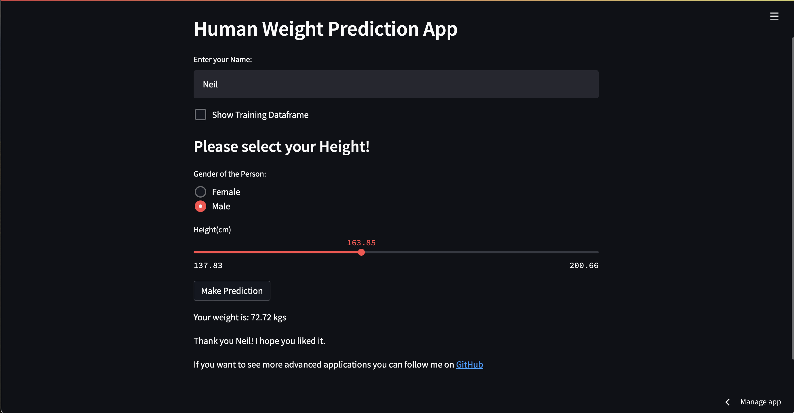

# Weight Prediction Application  

**WeightPrediction** is a simple interactive application that predicts weight based on height input. This tool provides an easy and intuitive interface to estimate weight using a pre-trained machine learning model.  

  

## Features  

- **Interactive Input**: Users can input their height to get a predicted weight.  
- **Real-Time Prediction**: The app provides instant weight predictions based on user input.  
- **Pre-Trained Model**: Uses a reliable machine learning model for accurate predictions.  
- **User-Friendly Interface**: Clean and intuitive design for seamless interaction.  

## How to Use  

1. **Clone the Repository**:  
   ```bash  
   git clone https://github.com/yourusername/weightprediction.git  
   cd weightprediction  
   ```  

2. **Install Dependencies**:  
   ```bash  
   pip install -r requirements.txt  
   ```  

3. **Run the Application**:  
   ```bash  
   streamlit run app.py  
   ```  

4. **Interact with the App**:  
   - Enter your height in the input field.  
   - The app will instantly predict your weight.  

## File Structure  

```
weight-prediction/  
│  
├── data/                      # Dataset used for training the model  
├── model/                     # Pre-trained model file  
│   ├── weight_prediction.pkl  # Machine learning model  
│  
├── app.py                     # Streamlit application script  
├── requirements.txt           # List of dependencies  
├── README.md                  # Project documentation  
└── LICENSE                    # License information  
```  

## Dependencies  

- Python 3.x  
- Streamlit  
- Pandas  
- Scikit-Learn  

Install all dependencies using:  
```bash  
pip install -r requirements.txt  
```  

## Contributing  

Contributions are welcome! Feel free to fork the repository, make improvements, and create a pull request.  

## License  

This project is licensed under the MIT License.  
